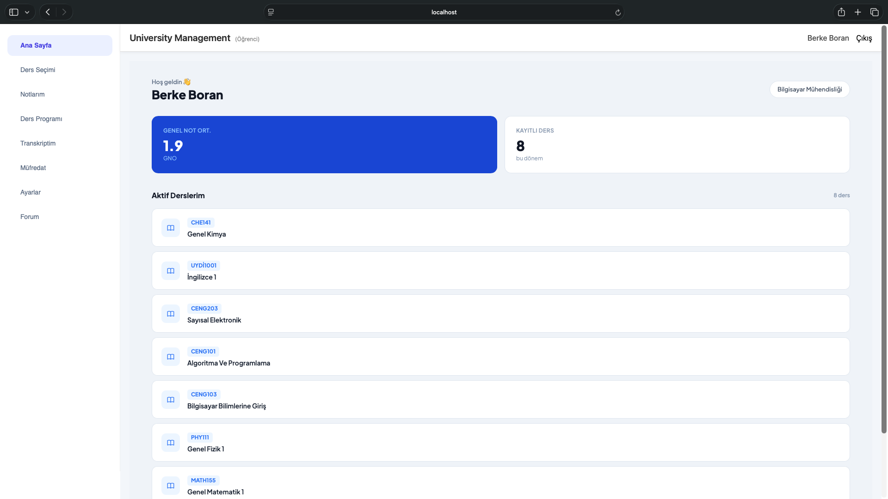
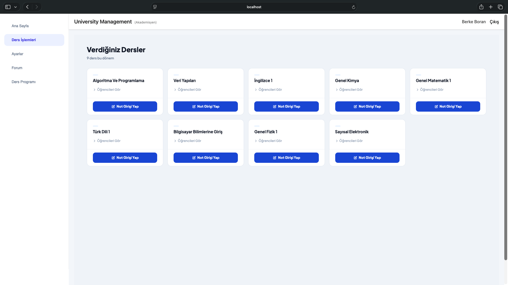
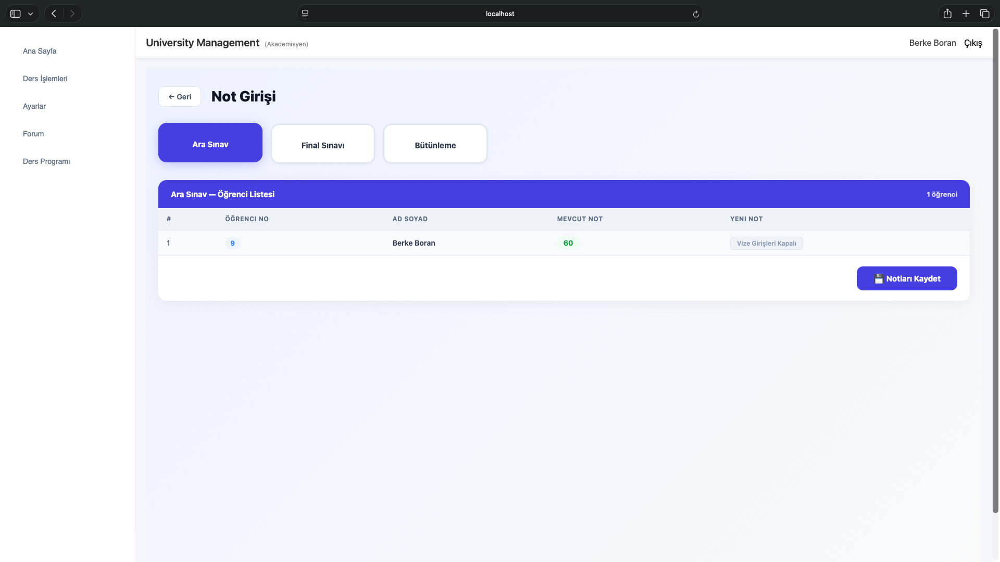
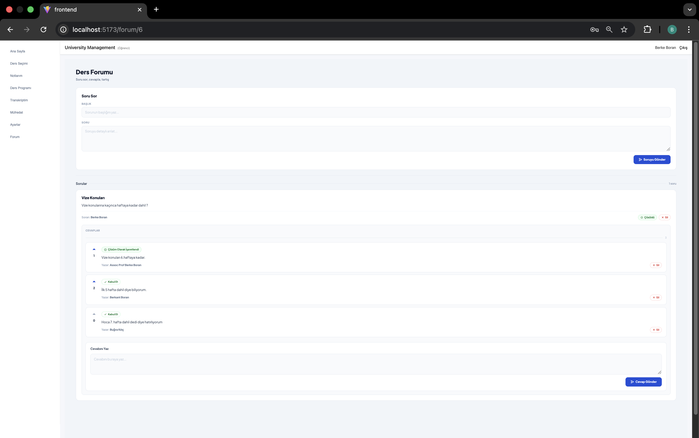

# University Management System

Üniversite yönetimi için Django REST API ve React tabanlı bir uygulama. Backend tarafında kullanıcı/rol yönetimi, ders ve şube planlama, kayıt ve notlandırma; frontend tarafında ise Vite + React arayüzü bulunur.

## Öne Çıkanlar
- Rol tabanlı kullanıcı modeli (Admin, Instructor, Student)
- Ders kataloğu ve ön koşul ilişkileri
- Bölüm, sınıf, dönem, ders saati ve sınıf (classroom) yönetimi
- Şube (section) açma, kapasite ve çakışma kontrolü
- Öğrenci ders kaydı (enrollment) ve notlandırma (AA-FF)
- Ders forumu: soru/cevap, kabul edilen cevap, beğeni

## Teknoloji Yığını
- Backend: Django 4.2 + Django REST Framework
- Auth: JWT (SimpleJWT)
- Veritabanı: PostgreSQL
- Frontend: React + Vite + Tailwind

## Mimari ve Veri Modeli (Özet)
- Custom user modeli `AbstractBaseUser` + `PermissionsMixin` ile tanımlıdır.
- Course & Prerequisites: self-referencing Many-to-Many.
- Enrollment: Student, Section ve notlandırmayı birleştirir.
- Forum: User, Question, Answer ilişkisi.

## Ekran Görüntüleri

**Student Features**

**Instructor Features**

**Forum Features**

## Kurulum (Docker ile hızlı başlangıç)
1. `docker compose up --build`
2. `docker compose run --rm web python manage.py migrate`
3. `docker compose run --rm web python manage.py createsuperuser`
4. Backend: `http://localhost:8000`
5. Frontend: `http://localhost:5173`

Varsayılan veritabanı bilgileri `docker-compose.yml` içinde geliştirme amaçlı olarak tanımlıdır.

## Lokal geliştirme

**Backend**
1. `python -m venv .venv`
2. `.venv` aktivasyonu (shell'e göre)
3. `pip install -r requirements.txt`
4. PostgreSQL ayarlarını `core/settings.py` içinde güncelle
5. `python manage.py migrate`
6. `python manage.py runserver`

**Frontend**
1. `cd frontend`
2. `npm install`
3. `npm run dev`
4. Frontend: `http://localhost:5173`

## Notlar
- CORS izinleri `core/settings.py` içinde `5173` ve `3000` için açık.
- Student ve Instructor kayıtları oluşturulurken geçici kullanıcı adı/şifre konsola yazdırılır.
